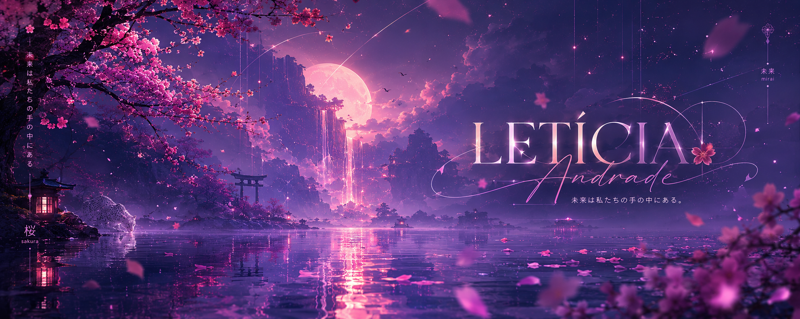

<div align="center">



<br><br>


<br>

# LETÍCIA ANDRADE

### creative developer • ui/ux • data & technology

</div>

<br>

---

## ✦ sobre mim

Sou apaixonada por tecnologia, design e experiências digitais que unem estética, emoção e propósito.

Atualmente estudo desenvolvimento, banco de dados e criação de interfaces, construindo projetos que conectam criatividade, acessibilidade e impacto real.

<br>

## ✦ atualmente

```txt
✦ construindo o projeto Ever Rise
✦ estudando Java, MySQL e Dados
✦ criando interfaces acessíveis
✦ explorando tecnologia com identidade visual
```

<br>

## ✦ tecnologias

<div align="center">


</div>

<br>

## ✦ projeto em destaque

<div align="center">

### Ever Rise

Tecnologia assistiva criada para devolver autonomia, segurança e dignidade para pessoas com mobilidade reduzida.

`acessibilidade` `autonomia` `segurança` `tecnologia humana`

</div>

<br>

## ✦ github status

<div align="center">


</div>

<br>

---

<div align="center">

### “technology should feel human.”

</div>
